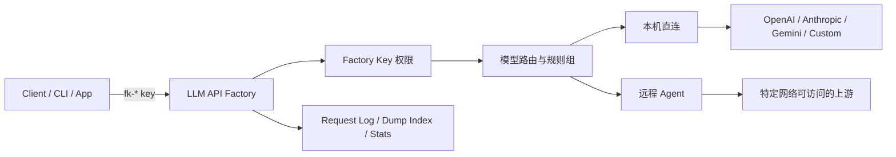
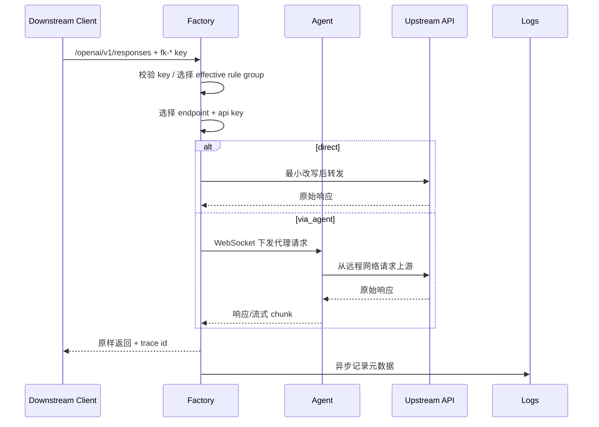

# LLM API Factory

LLM API Factory 是一个面向个人和小团队的 LLM API 网关。它把 OpenAI、Anthropic、Gemini 和自定义上游统一到一套控制面里，负责 API key 管理、模型路由、故障切换、用量观测，以及最重要的远程 Agent 代理执行。

核心定位：**标准协议最小侵入代理 + 规则组路由 + Agent 执行位置控制**。

## 为什么需要它

很多 LLM 使用场景不是“只有一个 API key”：

- 不同 provider、不同模型、不同 key 混在一起，需要统一管理。
- 某些上游只能从特定网络访问，本机或主服务器无法直连。
- 下游工具只想调用一个固定 base URL，不想关心哪个 key、哪个 endpoint 可用。
- 顺序主备、熔断和 fallback 要尽量稳定，避免每次都从坏 key 开始浪费时间。
- 想知道请求最终走了哪个 endpoint、消耗了多少 token、cache 是否命中。

LLM API Factory 解决的是这层“生产可用的个人网关”问题，不是公共 SaaS 计费平台。

## 核心卖点

- **标准协议最小侵入**：OpenAI / Anthropic / Gemini 标准链路尽量不改 body、不重组响应，只做必要的模型替换、鉴权注入和 trace 注入。
- **三类标准入口**：支持 OpenAI Chat Completions、Responses、Embeddings；Anthropic Messages；Gemini Models、GenerateContent、StreamGenerateContent、Interactions。
- **Agent 代理执行**：远程 VPS 上部署 Agent，主服务把请求转发给指定 Agent，由远端网络代替发起上游请求。
- **规则组和 Factory Key**：下游只拿一个 `fk-*` key，key 绑定可访问规则组，不能通过 header/body 越权。
- **缓存友好的顺序主备**：sequential 策略会优先保持在当前可用 key，失败后熔断跳过坏 key，尽量提高 provider 侧缓存命中率。
- **观测与审计**：请求日志、尝试日志、token 统计、cache hit、dump index、route explain、health probe、Agent 状态都在控制面里可查。
- **Custom 强定制隔离**：标准 provider 保持透明，复杂 header/query/body 模板只放在 `custom` provider。

## 架构



请求链路保持简单：



## 快速开始

依赖：

- Python 环境由 `uv` 管理
- 前端构建需要 Node.js 和 npm

安装并启动：

```bash
git clone https://github.com/Kuaizr/llm_api_factory.git
cd llm_api_factory

curl -LsSf https://astral.sh/uv/install.sh | sh
source "$HOME/.local/bin/env"

cd frontend
npm ci
cd ..

bash scripts/start_all.sh --rebuild-frontend --admin-token "change-me"
```

打开：

```text
http://127.0.0.1:8000
```

默认数据库是 SQLite：

```text
backend/llm_api_factory.db
```

生产环境建议至少配置：

```bash
export LLM_MASTER_AUTH_TOKEN="change-me"
export LLM_DATA_ENCRYPTION_KEY="a-stable-long-random-secret"
export LLM_APP_TIMEZONE="Asia/Shanghai"
```

## 下游调用示例

OpenAI Responses：

```bash
curl http://127.0.0.1:8000/openai/v1/responses \
  -H "Authorization: Bearer fk-your-factory-key" \
  -H "Content-Type: application/json" \
  -d '{
    "model": "gpt-5.5",
    "input": "Reply with exactly OK."
  }'
```

Anthropic Messages：

```bash
curl http://127.0.0.1:8000/anthropic/v1/messages \
  -H "Authorization: Bearer fk-your-factory-key" \
  -H "Content-Type: application/json" \
  -d '{
    "model": "claude",
    "max_tokens": 64,
    "messages": [{"role": "user", "content": "hi"}]
  }'
```

Gemini GenerateContent：

```bash
curl "http://127.0.0.1:8000/gemini/v1beta/models/gemini-proxy:generateContent?key=fk-your-factory-key" \
  -H "Content-Type: application/json" \
  -d '{
    "contents": [{"role": "user", "parts": [{"text": "hi"}]}]
  }'
```

## Agent 一句话流程

1. 在控制台 Agent 页面创建节点。
2. 生成部署命令。
3. 在远程 VPS 执行命令。
4. 在 API endpoint 中选择 `via_agent` 并绑定 Agent。
5. 下游继续调用 Factory，实际请求由远程 Agent 发出。

安装命令可以从主服务或 GitHub raw 拉取：

```bash
curl -fsSL https://raw.githubusercontent.com/Kuaizr/llm_api_factory/master/scripts/agent_install.sh | bash -s -- \
  --ws-url ws://factory.example.com/agent/ws \
  --heartbeat-url http://factory.example.com/agent/heartbeat \
  --agent-name edge-hk \
  --agent-token your-agent-token \
  --allowed-targets "api.openai.com,api.anthropic.com,generativelanguage.googleapis.com"
```

## 支持的 API 入口

- OpenAI: `/openai/v1/models`, `/openai/v1/chat/completions`, `/openai/v1/completions`, `/openai/v1/embeddings`, `/openai/v1/responses`, `/openai/v1/{path}`
- Anthropic: `/anthropic/v1/models`, `/anthropic/v1/messages`, `/anthropic/v1/{path}`
- Gemini: `/gemini/v1/models`, `/gemini/v1beta/models`, `generateContent`, `streamGenerateContent`, `/gemini/interactions`, `/gemini/v1/{path}`, `/gemini/v1beta/{path}`

模型列表接口会按 factory key 可访问的所有规则组取并集过滤，尽量保持原生 provider 的返回结构。

## 文档

- [快速开始](docs/quickstart.md)
- [Provider 与路由语义](docs/providers-routing.md)
- [Agent 部署与安全](docs/agent.md)
- [API 入口](docs/api.md)
- [部署与配置](docs/deployment.md)
- [观测、日志与缓存命中](docs/observability.md)
- [安全模型](docs/security.md)
- [v0.1 发布说明](docs/v0.1.md)

## 当前边界

- 不做 OpenAI / Anthropic / Gemini 之间的跨 provider 协议翻译。
- 不内置订阅账号 OAuth 转 API 的能力；这类能力风险更高，未来只会作为隔离的实验 provider 考虑。
- SQLite 适合个人和低并发单机使用，高并发建议切 PostgreSQL。
- Agent 是可信节点，部署前要配置目标 allowlist，不建议生产使用 `*`。

## 测试

```bash
cd backend
uv run pytest -q

cd ../frontend
npm test -- --run
```

## License

MIT
