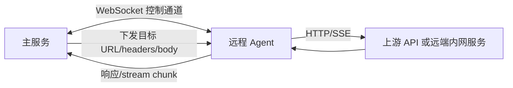

# Agent 部署与安全

Agent 是 LLM API Factory 的核心特色。它让请求从指定远程节点发出，而不是从主服务所在机器发出。

## 适用场景

- 某个上游只能从特定 VPS 网络访问。
- 主服务在国内或内网，不能直连部分 provider。
- 需要区分不同 region、network group 或出口 IP。
- 需要把 mock LLM 服务部署到远端内网，只允许 Agent 访问。

Agent 不是模型 runtime，也不是 provider。它只负责按主服务下发的请求去远端代理访问目标 URL。

渠道绑定 Agent 后，模型列表与自动探测、API Key 测试、OAuth/Codex Token 刷新以及真实推理请求都会使用同一个 Agent 网络出口。Agent 离线或请求失败时不会回退到主服务直连，而是按正常错误与路由故障切换逻辑处理；未绑定 Agent 的渠道则始终由主服务直连上游。

## 架构



## 控制台部署流程

1. 打开控制台 Agent 页面。
2. 创建 Agent 节点。
3. 生成部署命令。
4. 在远程 VPS 执行部署命令。
5. 等待 Agent 在线。
6. 编辑 API endpoint，选择 `via_agent` 并绑定该 Agent。
7. 使用 API key 测试功能确认请求确实从 Agent 发出。

## 安装命令

```bash
curl -fsSL https://raw.githubusercontent.com/Kuaizr/llm_api_factory/master/scripts/agent_install.sh | bash -s -- \
  --ws-url ws://factory.example.com/agent/ws \
  --heartbeat-url http://factory.example.com/agent/heartbeat \
  --agent-name edge-hk \
  --agent-token your-agent-token \
  --agent-region HK \
  --agent-network-group hk \
  --agent-labels openai,claude \
  --allowed-targets "api.openai.com,api.anthropic.com,generativelanguage.googleapis.com"
```

常用参数：

| 参数 | 说明 |
| --- | --- |
| `--ws-url` | 主服务 WebSocket 地址，必需 |
| `--heartbeat-url` | 主服务心跳地址 |
| `--agent-name` | Agent 名称，必需 |
| `--agent-token` | 控制台生成的 Agent token，必需 |
| `--agent-region` | 区域标识 |
| `--agent-network-group` | 网络分组 |
| `--agent-labels` | 逗号分隔标签 |
| `--agent-endpoint-url` | Agent 出口地址元数据 |
| `--allowed-targets` | 允许代理访问的目标 allowlist |
| `--repo` | 安装代码仓库 |
| `--repo-ref` | 分支、tag 或 commit |
| `--install-dir` | 安装目录 |
| `--no-systemd` | 不注册 systemd，使用 nohup |

## allowed targets

生产环境不要使用 `*`。建议只允许确切上游域名：

```text
api.openai.com,api.anthropic.com,generativelanguage.googleapis.com
```

Codex OAuth 端点默认还需要允许推理/模型地址 `chatgpt.com` 和刷新地址 `auth.openai.com`：

```text
chatgpt.com,auth.openai.com
```

如果 Codex 端点使用了自定义 base URL，也要把该 URL 的 hostname 加入 Agent allowlist。否则模型探测、Key 测试、Token 刷新和真实请求都会按 Agent 不可用处理，不会改由主服务直连。

也可以允许端口或 CIDR：

```text
10.0.0.8:9000,10.0.1.0/24
```

Agent 会做这些检查：

- 只允许 `http` 和 `https`
- 拒绝未显式允许的 `localhost`、私网 IP、非 global IP
- 对 hostname 做 DNS 解析，解析结果必须符合规则
- 不允许任意 scheme

如果你确实要让 Agent 访问远端内网 mock 服务，必须显式把对应 IP、端口或 CIDR 加入 allowlist。

## 删除与禁用

- `disable`：管理上禁用，不参与路由。
- `drain`：节点在线，但不分配新请求，适合维护前排空。
- `delete`：删除节点，并向在线 Agent 下发停止信号；远端 systemd 服务会尝试 disable + stop。

如果远端已经离线，delete 只能清理主服务数据库记录，远端进程需要登录 VPS 手动检查。

常用检查命令：

```bash
systemctl status llm-api-factory-agent.service
systemctl is-active llm-api-factory-agent.service
journalctl -u llm-api-factory-agent.service -n 100 --no-pager
ps aux | grep llm-api-factory-agent
```
