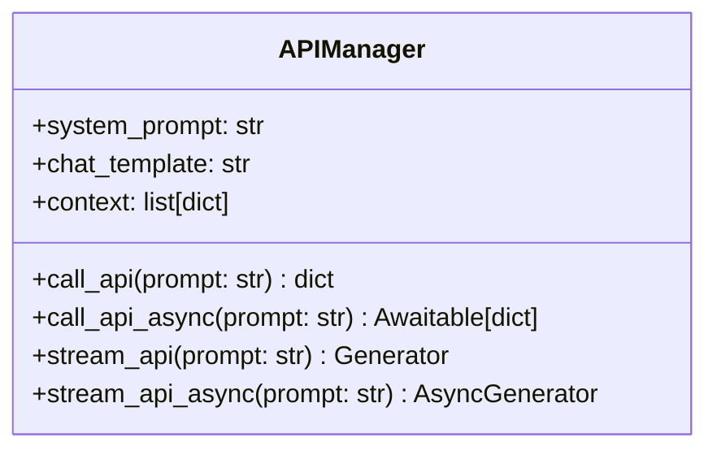

# 大模型API调用框架设计方案（支持异步版）

## 异步架构设计


## 新增异步功能

1. **异步API调用**：
```python
async def call_api_async(self, prompt: str) -> dict:
    for client in self.clients:
        try:
            if hasattr(client, 'call_api_async'):
                return await client.call_api_async(prompt)
            return client.call_api(prompt)
        except Exception:
            continue
```

2. **异步流式输出**：
```python
async def stream_api_async(self, prompt: str):
    for client in self.clients:
        try:
            if hasattr(client, 'stream_api_async'):
                async for chunk in client.stream_api_async(prompt):
                    yield chunk
                return
            for chunk in client.stream_api(prompt):
                yield chunk
            return
        except Exception:
            continue
```

3. **客户端接口要求**：
```python
class APIClient(ABC):
    @abstractmethod
    async def call_api_async(self, prompt: str) -> dict:
        pass
        
    @abstractmethod
    async def stream_api_async(self, prompt: str) -> AsyncGenerator:
        pass
```

4. **异步示例**：
```python
async def main():
    manager = APIManager()
    # 同步调用
    print(manager.call_api("你好"))
    # 异步调用
    print(await manager.call_api_async("你好"))
    # 异步流式
    async for chunk in manager.stream_api_async("你好"):
        print(chunk, end="")
```

## 实现步骤
1. 在APIClient基类添加异步方法
2. 实现各平台的异步客户端
3. 在APIManager中添加异步调用逻辑
4. 更新配置管理系统
5. 添加异步示例代码